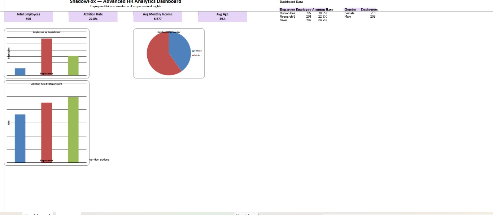

# shadowfox-data-analyst-advanced-level
ShadowFox Data Analyst Internship – Advanced Level Project | Interactive Business Dashboard &amp; Insights
# ShadowFox Data Analyst Internship – Advanced Level

## 📊 Interactive HR Analytics Dashboard & Insights

This project was completed as part of the ShadowFox Data Analyst Internship – Advanced Level.

## 🎯 Objective

The objective of this project is to analyze employee data and create an executive-style HR analytics dashboard that provides insights into workforce composition, employee attrition, compensation, and departmental performance.

## 🗂️ Dataset

The project uses an HR Analytics dataset containing employee demographic, job, compensation, and attrition-related information.

### Key Dataset Fields

- Employee Number
- Age
- Gender
- Marital Status
- Department
- Job Role
- Job Level
- Monthly Income
- Years at Company
- Years in Current Role
- Job Satisfaction
- Environment Satisfaction
- OverTime
- Business Travel
- Attrition
- Annual Income
- Years at Company

## 🛠️ Tools Used

- Microsoft Excel
- Data Cleaning
- Data Analysis
- Excel Formulas
- Charts & Visualizations
- Dashboard Design
- Business Insights

## 🔍 Analysis Performed

The analysis focuses on:

- Employee workforce distribution
- Department-wise employee analysis
- Gender distribution
- Employee attrition analysis
- Department-wise attrition rate
- Average monthly income
- Average employee age
- Workforce and compensation insights
- Identification of areas requiring employee retention attention

## 📈 Dashboard

An executive-style HR Analytics Dashboard was created in Microsoft Excel.

The dashboard includes:

- 👥 Total Employees
- 📉 Attrition Rate
- 💰 Average Monthly Income
- 🎂 Average Age
- 🏢 Employees by Department
- 👨‍💼 Employees by Gender
- 📊 Attrition Rate by Department
- 💡 Key Insights & Recommendations

## 🖼️ Dashboard Preview

## 💡 Key Insights

The dashboard helps identify workforce patterns, departmental differences, employee attrition levels, and compensation trends.

The analysis can support HR teams in:

- Identifying departments with higher attrition
- Understanding workforce composition
- Monitoring employee compensation
- Improving employee retention strategies
- Supporting data-driven HR decisions

## 📌 Recommendations

Based on the analysis, organizations can:

1. Investigate departments with comparatively higher attrition.
2. Develop targeted employee retention strategies.
3. Monitor workload and overtime-related patterns.
4. Review compensation and career-growth opportunities.
5. Use regular HR analytics dashboards for decision-making.

## 📁 Project Files

- `README.md` – Project documentation
- `ShadowFox_Advanced_HR_Analytics_Dashboard_Final.xlsx` – Excel dashboard and analysis
- `shadowfox_advanced_hr_analytics_dataset.csv` – HR analytics dataset
- `dashboard.png` – Dashboard preview

## 👩‍💻 Author

**Nageswari Eduru**

ShadowFox Data Analyst Internship – Advanced Level

